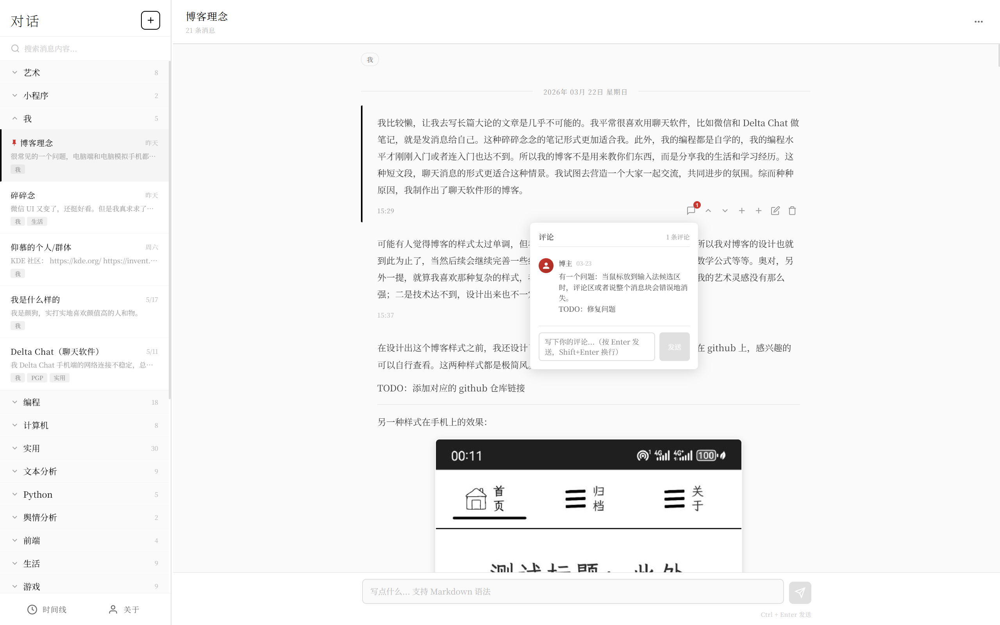
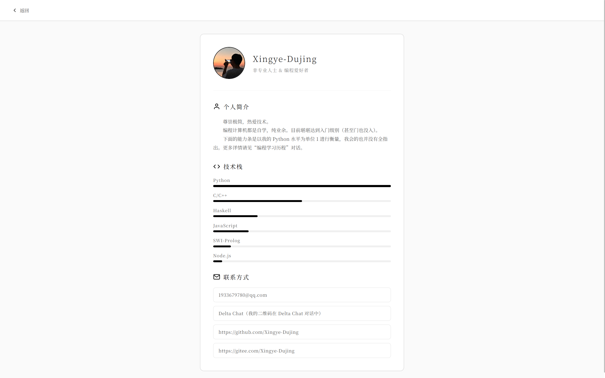
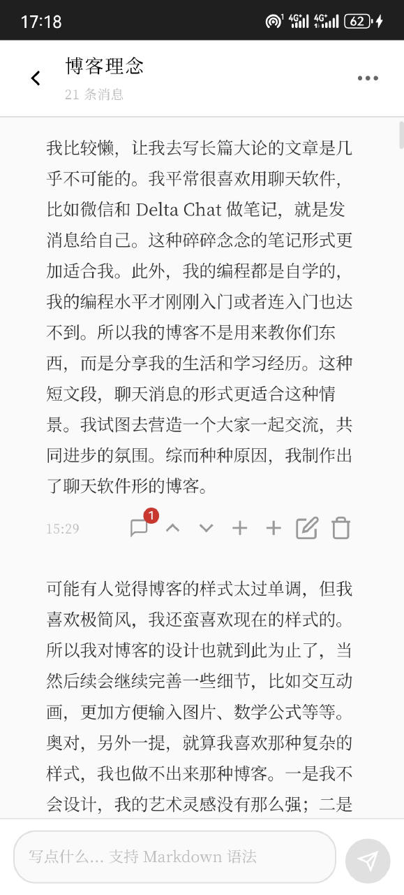
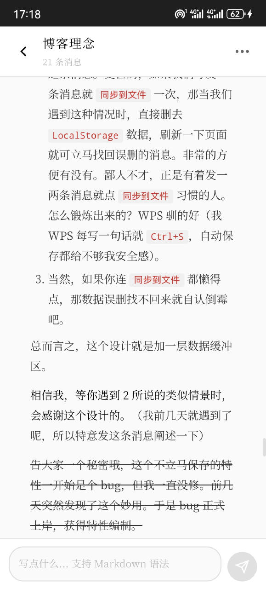
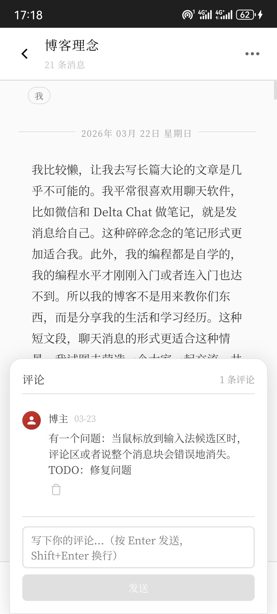
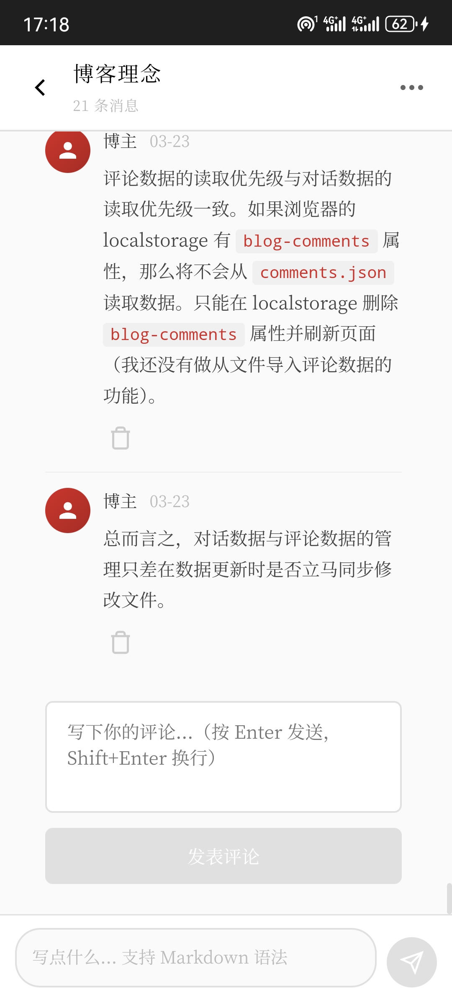
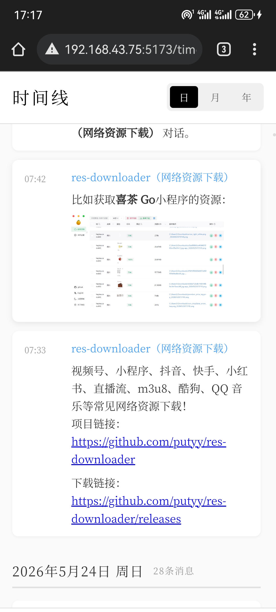
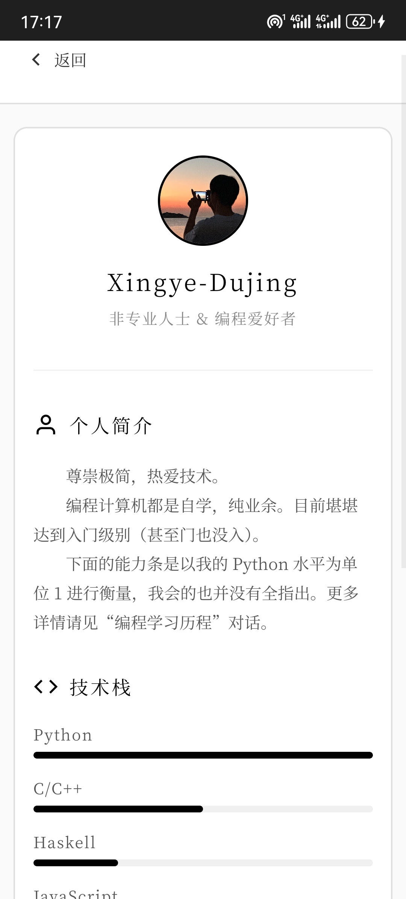

# 我的博客

极简风格、聊天式布局的个人博客，基于 Vue 3 和 Vite 构建

在线访问我的博客：

- https://xingye-blog.zh-cn.edgeone.cool
- 需翻墙：https://my-blog-eight-dun.vercel.app

> 在线版本由 `production` 分支构建并部署，与当前 `main` 分支有所不同。两者的区别及各自作用，请阅读其中的 **「博客理念」对话**

## 效果图

- **电脑端**（Windows 11 谷歌浏览器）






- **手机端**（安卓谷歌浏览器）








注：手机端是**局域网访问**，访问方法见其中 **「Vue」对话** 的第二条和第三条消息。做手机端适配的原因是我可以开着电脑，躺在床上用手机写内容

## 特性

- **极简设计**：干净简洁的界面，聚焦内容本身
- **Markdown 支持**：内置 Markdown 渲染，支持代码高亮
- **数学公式**：支持 LaTeX 数学公式渲染（KaTeX）
- **聊天式布局**：文章以独特的聊天式布局展开，并附带简易的评论功能
- **响应式设计**：完美适配移动端与桌面端

## 技术栈

- **框架**：Vue
- **构建工具**：Vite
- **状态管理**：Pinia
- **路由**：Vue Router
- **第三方包**：markdown-it + highlight.js + KaTeX + markdown-it-texmath

## 项目结构

```
src/
├── components/               # 可复用组件
│   ├── ChatList.vue          # 聊天列表
│   ├── ChatView.vue          # 聊天视图
│   ├── CommentSection.vue    # 评论区域
│   └── MessageBubble.vue     # 消息气泡
├── composables/              # 组合式函数
│   └── useMarkdown.js        # Markdown 渲染工具
├── stores/                   # Pinia 状态管理
├── views/                    # 页面视图
│   ├── HomeView.vue          # 首页
│   ├── TimelineView.vue      # 时间线
│   └── AboutView.vue         # 关于页面
├── App.vue                   # 根组件
└── main.js                   # 入口文件
```

## 如何使用

1. 安装依赖
   ```bash
   npm install
   ```

2. 开发模式下运行
   ```bash
   npm run dev
   ```

3. **务必从头到尾阅读「博客理念」对话**。
   该对话详细说明了 `chats.json` 与 `comments.json` 的不同处理方式，以及 `main` / `production` 分支的区别。不阅读可能会导致使用中出现问题。

4. 如果你想将此博客项目变成自己的博客：

- 清空 `chats.json`、`comments.json` 以及浏览器 **LocalStorage** 中的相关内容（**LocalStorage 必须清空**）
- 随后即可按需写入你自己的内容
- 若希望部署到云端服务器（如 Vercel），请参照「博客理念」对话中的说明，与 `production` 分支做好数据同步，并基于 `production` 分支构建部署

## 注意

- 当前 `main` 分支**仅适用于 `npm run dev` 开发模式**
- 如需执行 `npm run build` 并部署，请切换到 `production` 分支
- `main` 与 `production` 分支的区别及各自作用，详见其中的「博客理念」对话
- `main` 分支的对话数据自 2026 年 6 月 17 日起就不再更新。只有 `production` 分支的数据是实时更新的

## 更新日志

- 2023.06.12：添加了大纲导览功能