# 我的博客（`production` 分支）

本分支是 `main` 分支的构建部署版本，相比于 `main` 分支，主要变化如下：

- 移除了对话编辑功能
- 移除了时间线页面和关于页面
- 样式进行了部分调整
- **不再使用 LocalStorage**，改为直接读取 `chats.json` 和 `comments.json`，保证每次打开页面都展示最新内容

在线访问我的博客：

- https://xingye-blog.xyz
- 需翻墙：https://my-blog-eight-dun.vercel.app

## 效果图

- **电脑端**（Windows 11 谷歌浏览器）

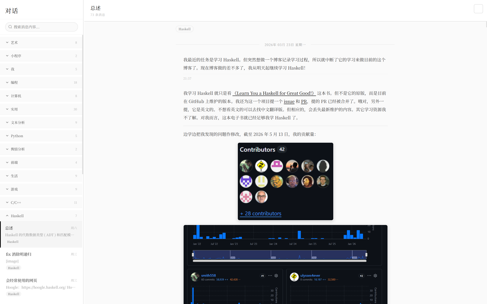
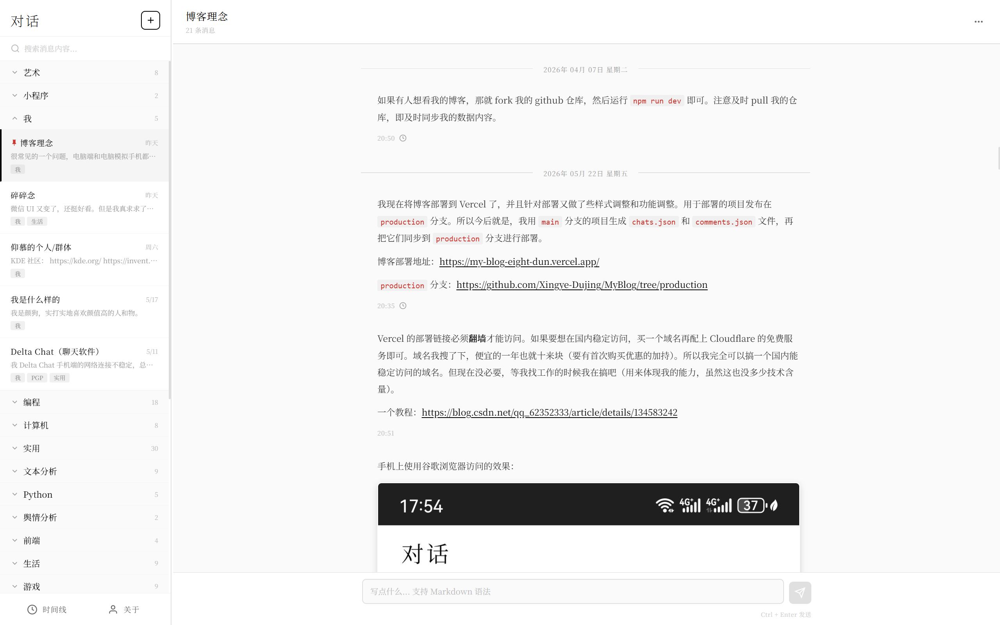
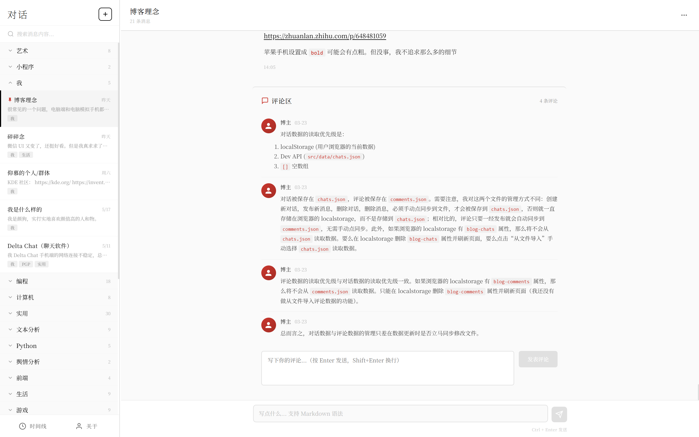
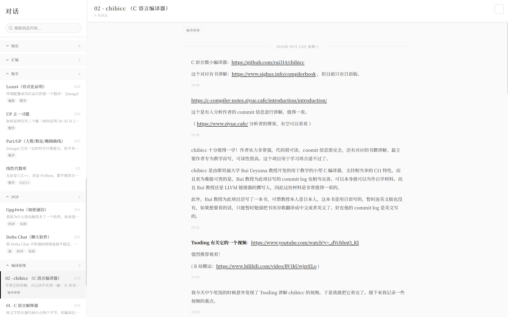

- **手机端**（安卓谷歌浏览器）

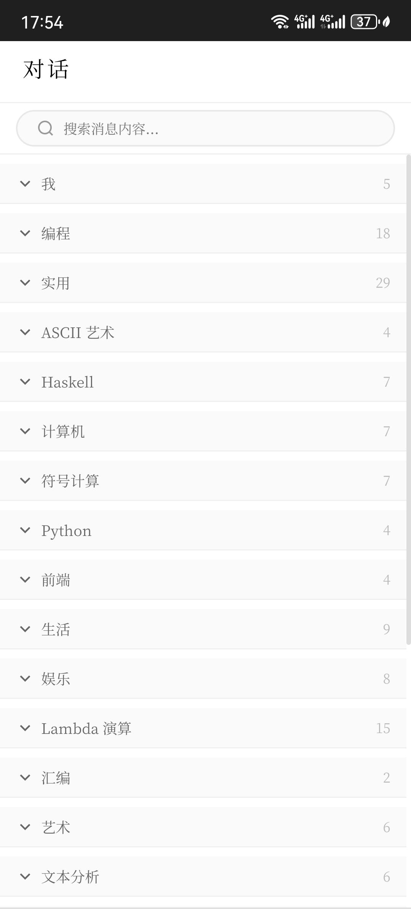
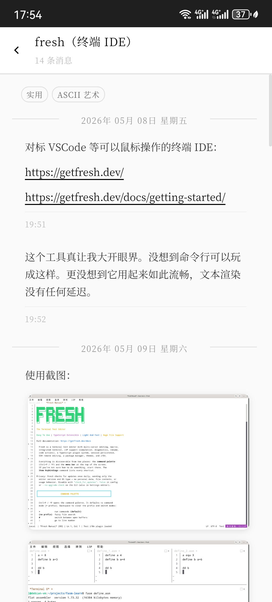
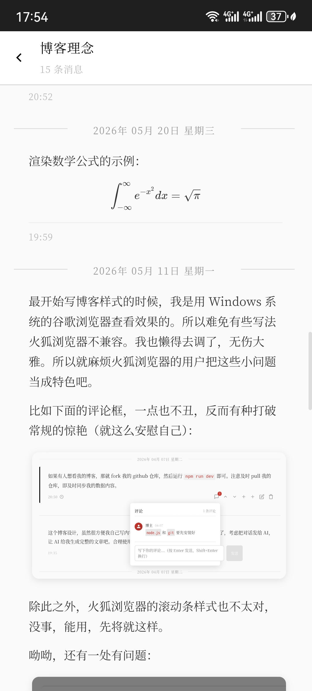
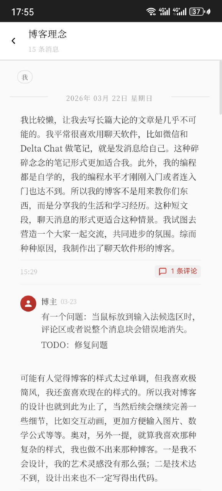
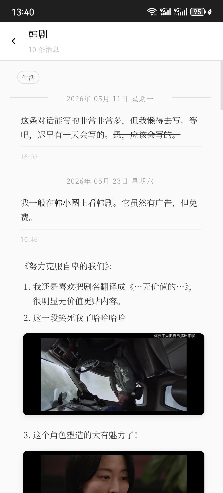
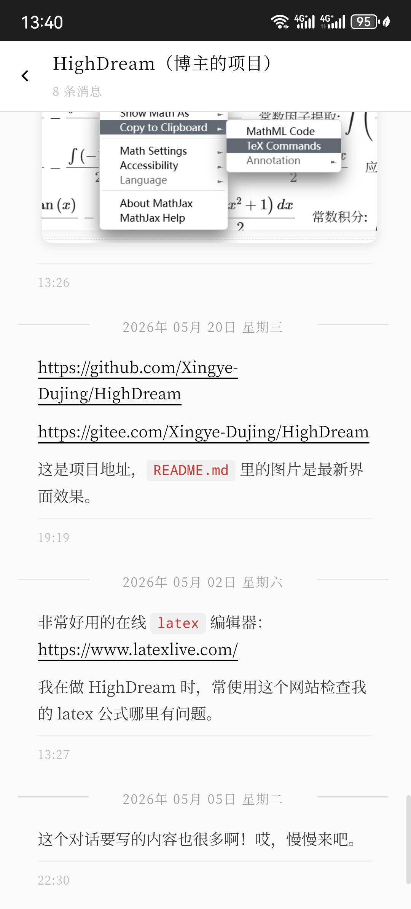
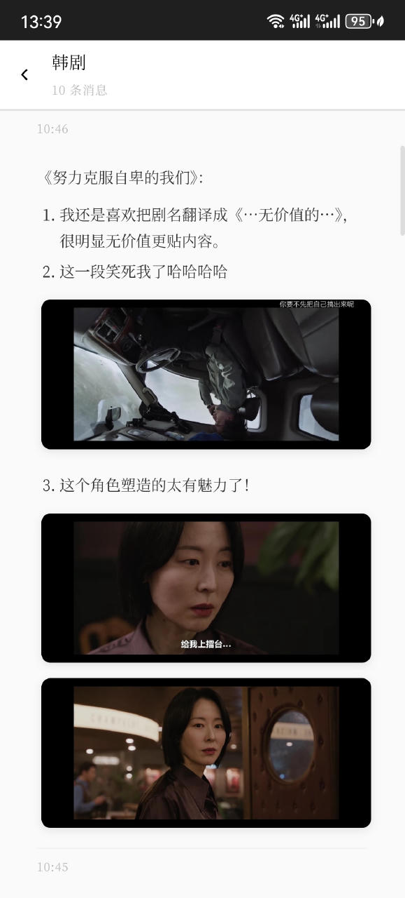

> 注：手机端可直接访问在线版，无需像 `main` 分支进行局域网访问。

## 如何使用

1. 安装依赖

   ```bash
   npm install
   ```

2. 开发模式下运行

   ```bash
   npm run dev
   ```

3. 构建生产版本

   ```bash
   npm run build
   ```

4. 推荐使用 GitHub 搭配 Vercel 一键部署（我的在线版即采用此方式）

5. 若要在国内能正常访问，那就买个域名再加上 Cloudflare 免费服务即可（详见博客里的 Vercel 对话）。
